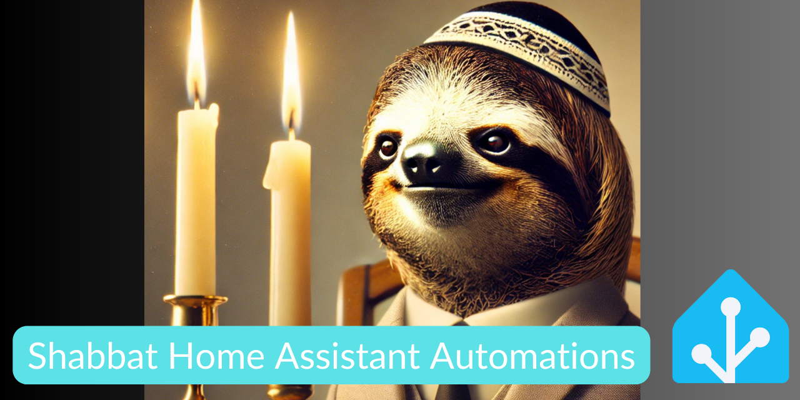
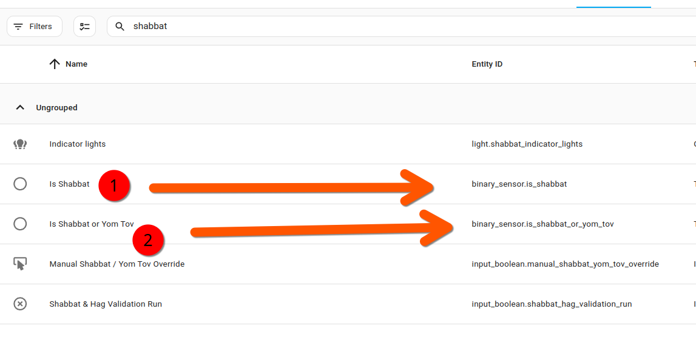
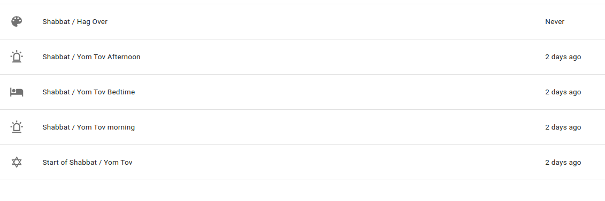
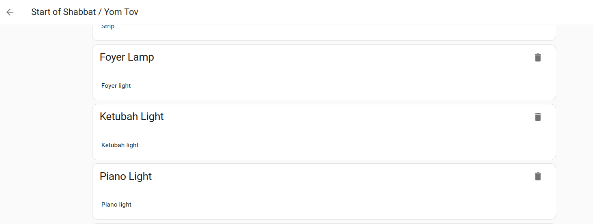
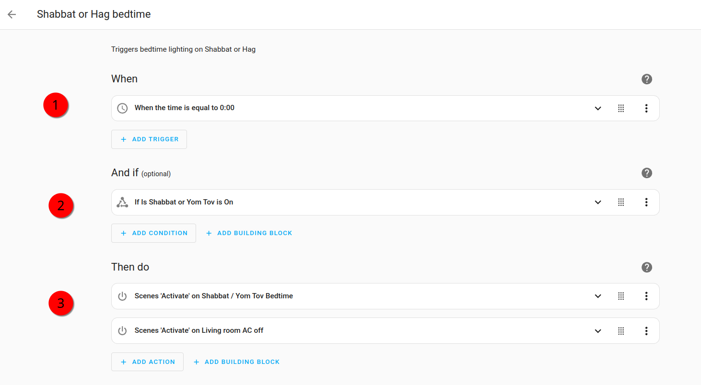

# Home Assistant For Yom Tov & Shabbat Observance (Jan 2025)



The purpose of this repository is simply to provide an updated guide to creating home automations using Home Assistant to support the observance of Shabbat and Yom Tov.

I previously documented some ways to configure home automations for this purpose, but this updated repository reflects some modifications which simplify setup.

I try to always give credit where credit is due. And on this instance I have to credit a robot! Thanks to Claude Sonnet 3.5 for rewriting some of the YAML automations for simplicity and for eliminating redundancy! 

If you're here, you probably know what Shabbat, Yom Tov, and Home Assistant all are! If not, its a weekly 24 hour Jewish religious observance in which Jews refrain from using electricity. It provides a perfect use case for home automation!

In this repository I'll explain how to set up sensors and automations driven by your local Shabbat times. 

## Data Sources

Firstly, let me explain what sources were relying on to make these work:

[](https://www.hebcal.com/home/category/general)
[](https://github.com/rt400)

[Hebcal](https://www.hebcal.com) does the holy work of providing an API for Jewish religious times!  

The [Jewish-Sabbaths-Holidays](https://github.com/rt400/Jewish-Sabbaths-Holidays) Home Assistant integration (available via HACS) does the additional holy work of Making this API accessible. As a Home Assistant integration, which can be added to. 

Assuming that your home is a stationary object (I guess there's probably a separate extension for nomadic smart-homers!), you'll firstly need to configure your geolocation in Home Assistant.

## Setting Up Your Geocordinates

Add your geocordinates like this:

```yaml
   homeassistant:
     latitude: 32.0667
     longitude: 34.7667
     time_zone: Asia/Jerusalem
```

You can get your coordinates from a few dedicated utilities. You'll also need to be using [HACS](https://hacs.xyz/).

## Add Your Shabbat Settings

Using YAML (that is, making changes to your `configuration.yaml`), you'll also want to add the sensor that provides the basic Shabbat in and out times:

```yaml
# Example configuration.yaml entry
sensor:
  - platform: hebcal
    resources:
      - shabbat_in
      - shabbat_out
```

Here is a more extensive configuration showing the additional resources that can be added and which are provided from the add-on:

```yaml
# Example configuration.yaml entry
sensor:
  - platform: hebcal
    havdalah_calc: 42
    time_before_check: 10
    time_after_check: 1
    jerusalem_candle: False
    tzeit_hakochavim: False
    omer_count_type: 0
    language: english
    resources:
      - shabbat_in
      - shabbat_out
      - parasha
      - hebrew_date
      - is_shabbat
      - yomtov_in
      - yomtov_out
      - is_yomtov
      - yomtov_name
      - event_name
      - omer_day
      - zmanim
```

Note that you can use Jerusalem's specific candlelighting *minhag* and even set your preferred *havdala* calculation method. 

Full documentation for setting up the integration can be found on its [Github repository](https://github.com/rt400/Jewish-Sabbaths-Holidays?tab=readme-ov-file).


## A Combined Shabbat & Yom Tov Sensor

Note that the Jewish Calendar add-on provides two binary sensors for whether it is currently Shabbat or Yom Tov.

For Shabbat it's:

`is_shabbat`

And for Yom Tov it's

`is_yomtov`.

While that makes sense from using this add on for a while, two things occurred to me:

1) For the purpose of my home automations, and probably those of many, it doesn't matter whether whether it's Shabbat *or* Yom Tov. just whether it's either or neither. Therefore, a single binary sensor which probes for both states would be sufficient
2) At the time of writing, the  `is_yomtov` sensor either responds with `No` or the name of a Yom Tov.

 So to streamline how the sensor was integrated into my system, I created a single downstream binary sensor which pulls for both Shabbat and Yom Tov and interprets the `No Info` state of the `is_yomtov` sensor as false and anything else to be true. 

 And by "I did this" I mean "Claude did this!" because a little known fact about me is that YAML drives me a bit crazy. 

 Here's the sensor:

 ```yaml
 binary_sensor:
  - platform: template
    sensors:
      is_shabbat:
        friendly_name: "Is Shabbat"
        value_template: "{{ states('sensor.hebcal_is_it_shabbat') == 'True' }}"
      is_yom_tov:
        friendly_name: "Is Yom Tov"
        value_template: "{{ states('sensor.hebcal_is_it_yom_tov') != 'No Info' }}"
      is_shabbat_or_yom_tov:
        friendly_name: "Is Shabbat or Yom Tov"
        value_template: >-
          {{ states('sensor.hebcal_is_it_shabbat') == 'True' or
             states('sensor.hebcal_is_it_yom_tov') != 'No Info' }}
```

For those who similarly find configuring YAML just a little bit tedious, you can set this up as a helper. 

But even if you define the helper sensors used on code, they will be available in the UI. 




To cover all eventualities, I actually created 3 downstream helper sensors (is it Shabbat? is it yom tov? Is it Shabbat or Yom Tov?). If you wanted a more advanced setting, you could even use multiple upstream sensors to have one available as a backup. However, for a simple implementation, I would say that that is probably not necessary, and the Jewish calendar add-on has been reliable enough for me at least

## Using Your Shabbat Or Yom Sensor To Drive Automations

Here are the list of scenes that my wife and I have configured.

There is almost certainly a better way of doing this, but this is at least a methodology I can see that works. 

We have scenes for:

-  The start of Shabbat (or Hag)
-  Shabbat's evening (or Hag)
-  Shabbat morning (or Hag)
- Shabbat afternoon (or Hag)
- Shabbat going out (or Hag)



Each scene applies a different lighting configuration and we make small adjustments to them periodically.



I purchased a couple of Zigbee light bulbs to use as dedicated Shabbat indicators. They are simply added to the scenes and go on at the start of Shabbat and go off when Shabbat's over. These provide a visual indicator as to when Shabbat is happening. I have plans to make a more beautiful DIY project using the light as a display. 

## Linking Scenes To Automations

Finally, the last step!

I use automations to link my scenes to specific times and I add a condition that the automation will only execute if the Shabbat or Yom Tov sensor is true:



 This method makes it easy to make periodic adjustments to your timings as you get comfortable with your automations. For example, if you decide that midnight's a little bit too late for the bedtime automation to kick in, you can simply change the automation so that the evening scene hits at 11:00 PM. 

 Here's the YAML:

 ```yaml
 alias: Shabbat or Hag bedtime
description: Triggers bedtime lighting on Shabbat or Hag
triggers:
  - at: "00:00:00"
    trigger: time
conditions:
  - condition: state
    entity_id: binary_sensor.is_shabbat_or_yom_tov
    state: "on"
actions:
  - metadata: {}
    target:
      entity_id: scene.shabbat_bedtime
    action: scene.turn_on
    data: {}
  - metadata: {}
    target:
      entity_id: scene.living_room_ac_off
    action: scene.turn_on
    data: {}
mode: single
```

## Shabbat Things That Can Be Automated

You can automate:

- The turning on and off of lights. 
- Turning a Plata on and off. If your plate isn't smart, then you can put it on a smart plug and add it to the scenes. 
- Shabbat indicators. 